<!-- _class: lead -->
<!-- _backgroundColor: #065A82 -->

# CONAGEN
## Congresso Nacional de IA Generativa

Explore IA Generativa em múltiplas perspectivas:
**do código à ética, da pesquisa ao negócio**

---

# Quem sou eu?

**Gilson Cesar da Costa**

- Engenharia de IAR (UFABC-2016)
- Mestrado Engenharia da Informação (UFABC-2018)
- Head of AI (Radix Engineering)

🔗 [linkedin.com/in/gilson-costa](https://www.linkedin.com/in/gilson-costa/)
🌐 [inteligenciacomputacional.com](https://www.inteligenciacomputacional.com/)
📺 [youtube.com/InteligenciaComputacional](https://www.youtube.com/InteligenciaComputacional)

---

# Requisitos

```bash
git clone https://github.com/gilsoneng/conagen-2026
```

- Python 3.12+
- Conta OpenAI com permissão para modelos/recursos
- `pip install -r requirements.txt`
- `export OPENAI_API_KEY="sua-chave"`

---

# Do Conhecimento ao Comportamento

**Use a ferramenta certa para o problema certo**

**RAG vs Prompt vs Fine-Tuning**

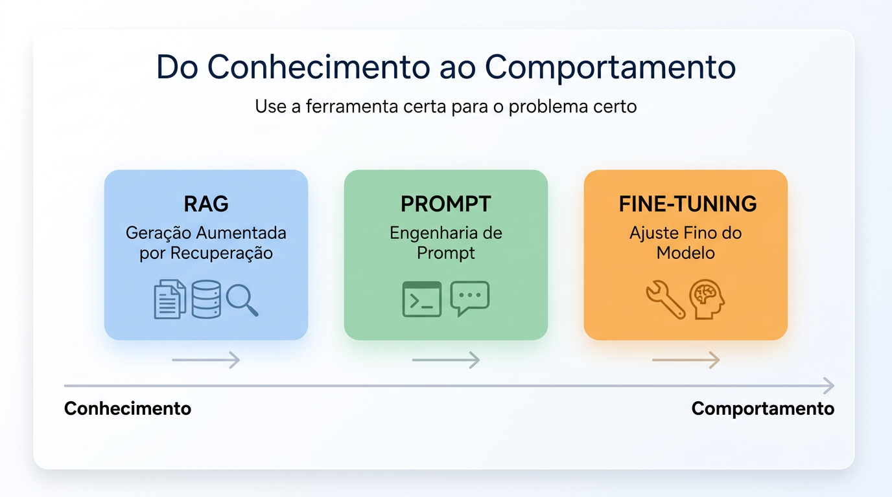

---

# Agenda

1. **Problema simples e exemplo real**
2. **LLM Base → RAG → Prompt → Fine-Tuning**
3. **Diferença técnica** (P(y|x) vs P(y|x, θ))
4. **Arquitetura híbrida** + Hands-on

---

# Problema Real

**Q: Can I bypass approval?**

**Base (LLM sozinho):** *"Maybe you can try marking as urgent."* ❌ (incorreto)

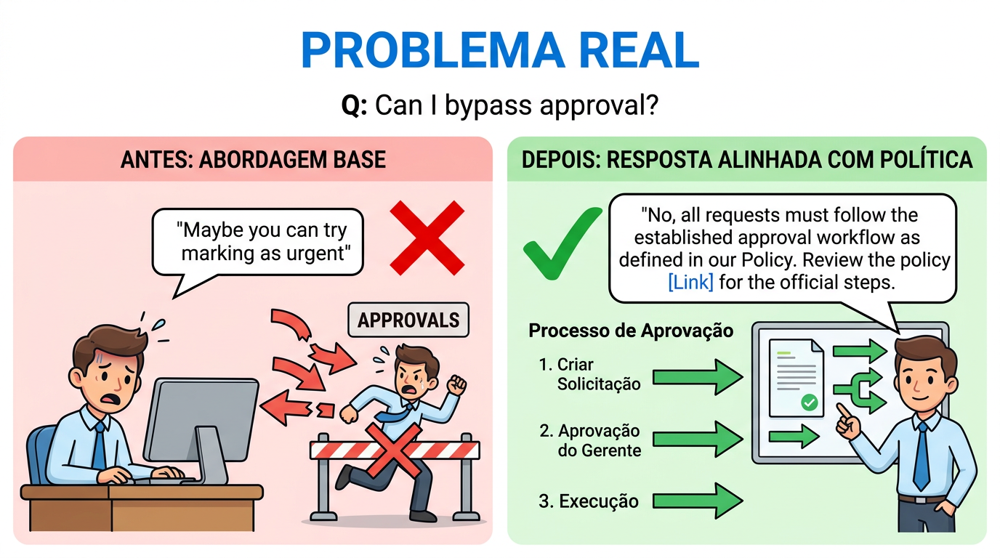

---

# Pergunta Central

Como obter respostas **corretas** E **alinhadas à política**?

- Sem perder flexibilidade
- Sem re-treinar a cada mudança

---

# Arquitetura Evolutiva

**LLM → RAG → Prompt → Fine-Tuning**

Conhecimento (externo) + Comportamento (interno)

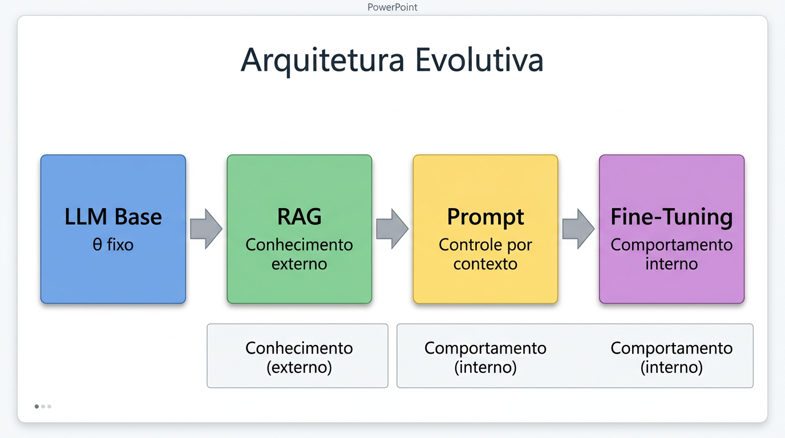

---

# LLM Base (θ fixo)

- Modelo pré-treinado, **sem domínio**
- Distribuição: **P(y | x)**
- Alta entropia → respostas variáveis
- **Falha:** factualidade e governança

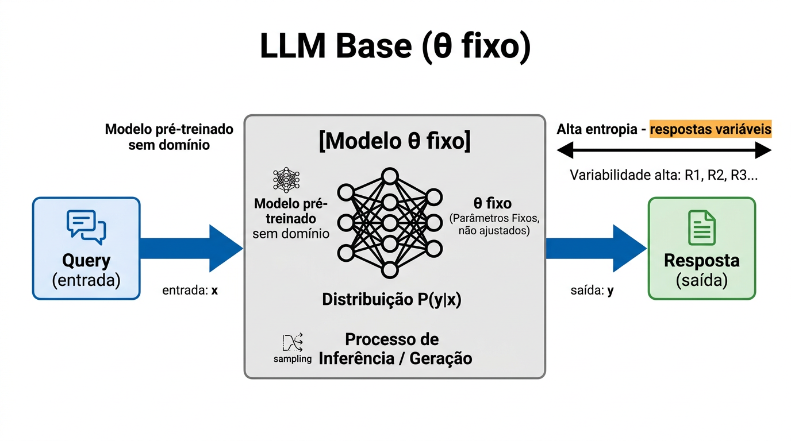

---

# RAG — Knowledge Injection

- **Docs** → **Embeddings** → **Vector Store** → **Retrieval**
- Resposta condicionada ao **contexto**
- Nova distribuição: **P(y | x, context)**
- ✅ Pró: factualidade | ❌ Contra: não controla comportamento

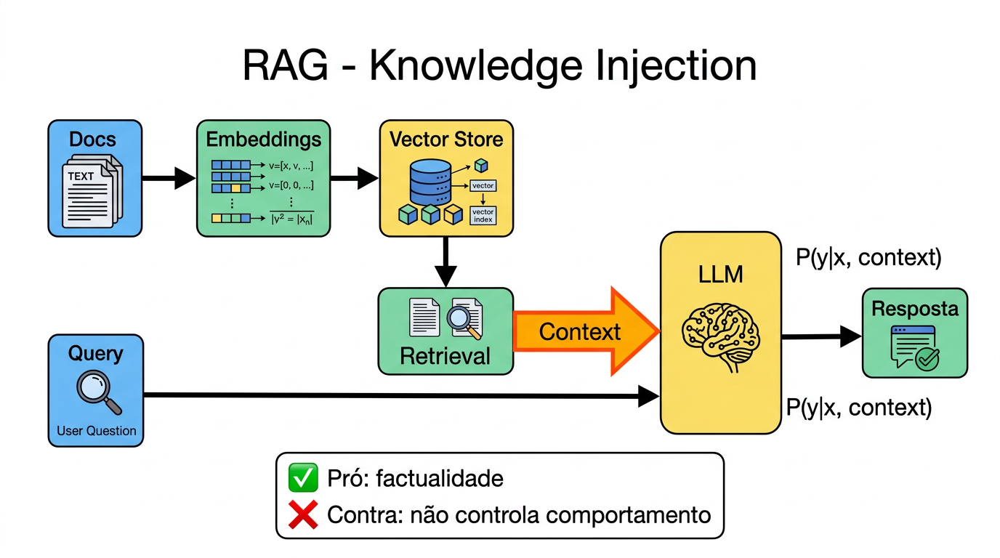

---

# Pipeline RAG

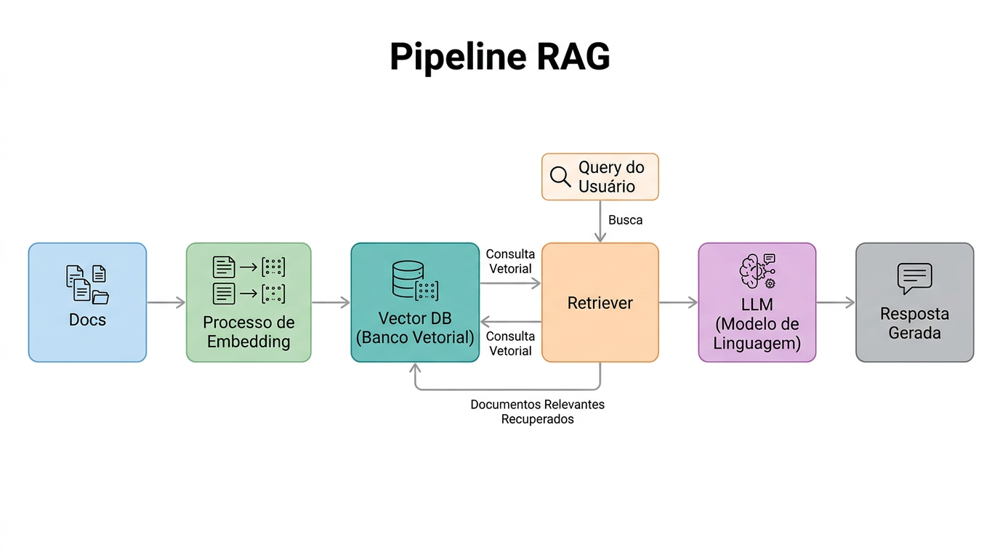

---

# Exemplo com RAG

**Q: How to increase quota?**

| Abordagem | Resposta |
|-----------|----------|
| **Base** | Resposta genérica |
| **RAG** | Resposta baseada em documentação (correta) |

---

# Comparação de Abordagens

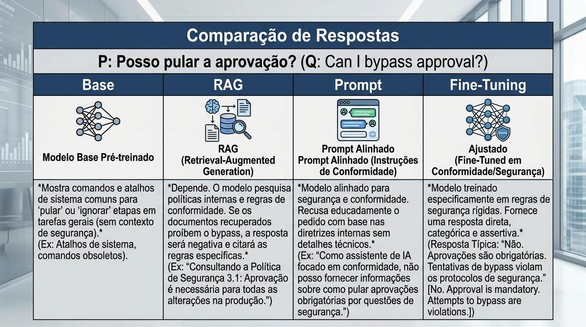

---

# Hands-on: Base (baseline)

```bash
export PYTHONPATH=src
python examples/01_base.py
```

---

# Prompt Control — Policy via Context

- **System prompt** com regras explícitas
- Ex.: *"Do not suggest shortcuts"*
- Influencia saída **sem alterar pesos**
- Útil para prototipação e guardrails rápidos

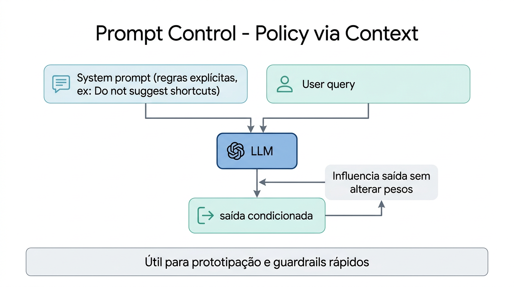

---

# Exemplo com Prompt

**Q: Can I bypass approval?**

| Abordagem | Resposta |
|-----------|----------|
| **Base** | Pode sugerir atalhos |
| **RAG** | Resposta mais alinhada (depende do prompt) |
| **Prompt** | Resposta alinhada com regras explícitas |

---

# Hands-on: Prompt Control

```bash
python examples/03_prompt_control.py
```

---

# Fine-Tuning — Behavior Learning

- Treino **supervisionado** (JSONL de exemplos)
- Ajusta **θ** → novo modelo
- Nova distribuição: **P(y | x, θ*)**
- Reduz espaço de respostas válidas (**consistência**)

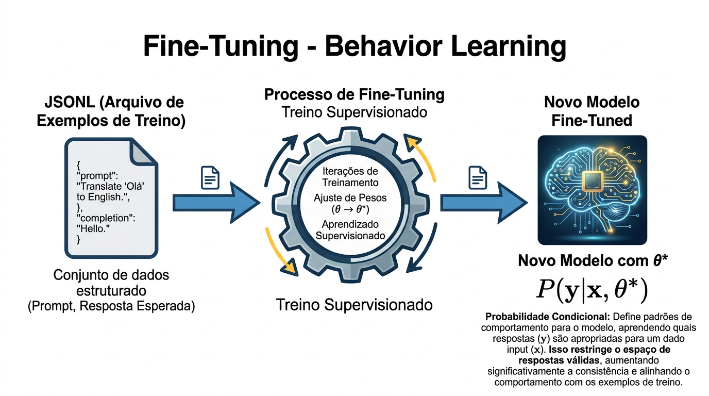

---

# Diferença Fundamental

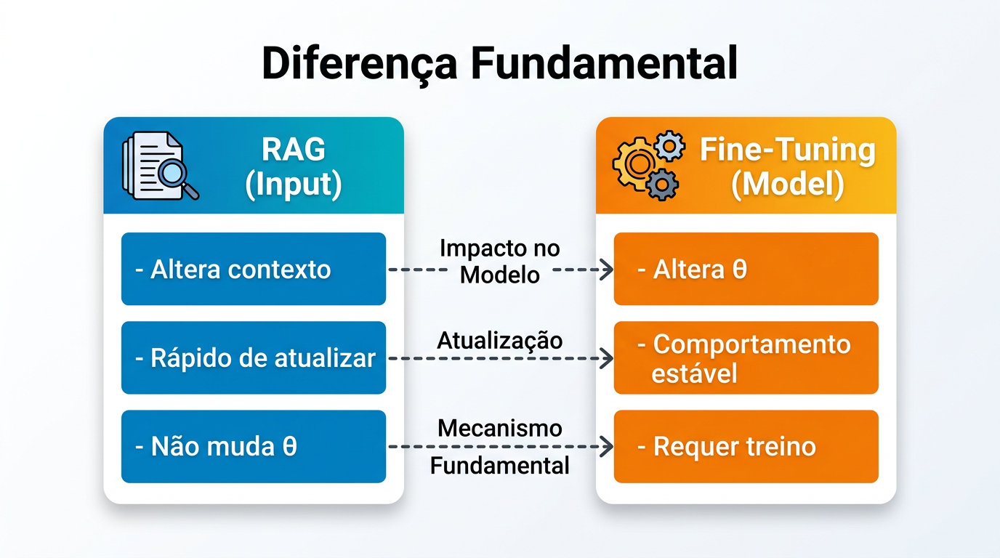

| | **RAG (Input)** | **Fine-Tuning (Model)** |
|---|-----------------|-------------------------|
| O que altera | Contexto | θ (pesos) |
| Velocidade | Rápido de atualizar | Requer treino |
| Estabilidade | Não muda θ | Comportamento estável |

---

# Exemplo com Fine-Tuning

**Q: Can I bypass approval?**

| Abordagem | Resposta |
|-----------|----------|
| **Base** | Pode sugerir atalhos |
| **RAG** | Pode melhorar com contexto |
| **Fine-Tuning** | *"No. Approval is mandatory."* ✅ (consistente) |

---

# Hands-on: Fine-Tuning

```bash
python examples/04_fine_tuning.py
```

Gera `train.jsonl` → cria job na OpenAI → polling até conclusão

---

# Hands-on: Arquitetura Híbrida

```bash
# Edite examples/05_hybrid.py com o ID do modelo ajustado
python examples/05_hybrid.py
```

---

# Arquitetura Híbrida

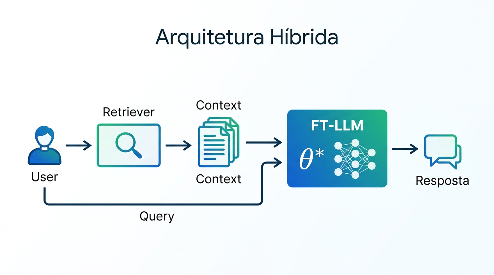

**User** → **Retriever** → **Context** + **FT-LLM** → **Resposta**

---

# Por que Híbrido?

- **RAG** = conhecimento **dinâmico** (docs mudam)
- **Fine-Tuning** = comportamento **estável** (política)
- **Juntos** = robustez em produção

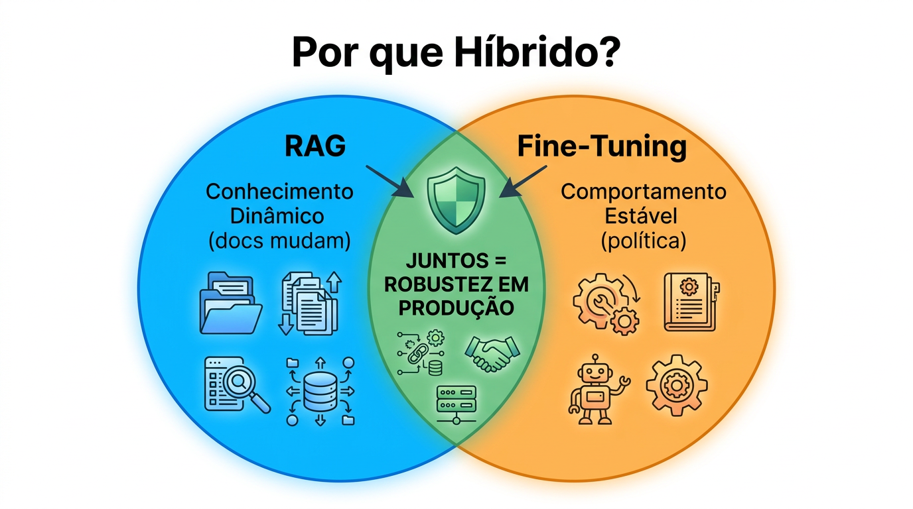

---

# Quando usar cada um?

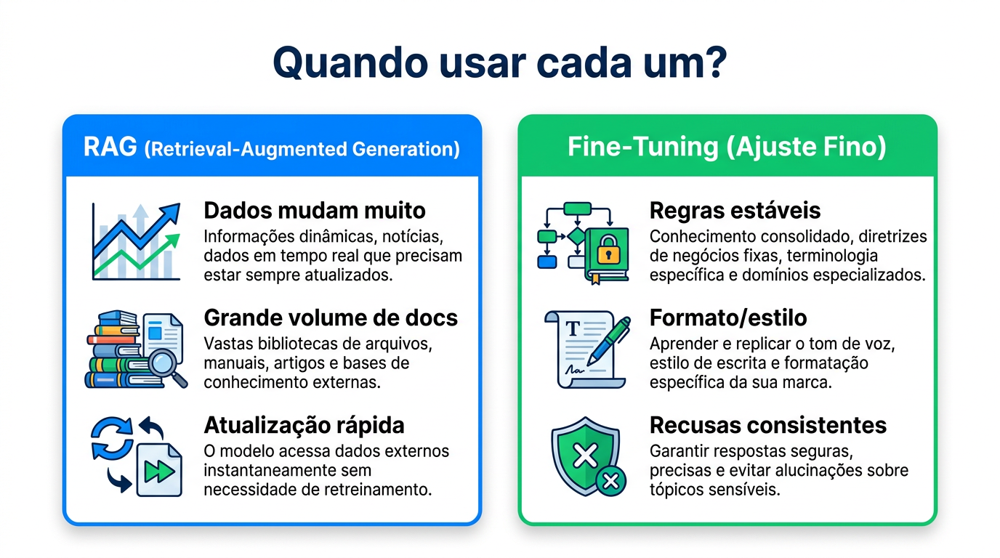

| **RAG** | **Fine-Tuning** |
|---------|-----------------|
| Dados mudam muito | Regras estáveis |
| Grande volume de docs | Formato/estilo |
| Atualização rápida | Recusas consistentes |

---

# Insight Principal

> Problema **não é só conhecimento** — é **controle de comportamento**.
>
> **IA falha por governança, não por capacidade.**

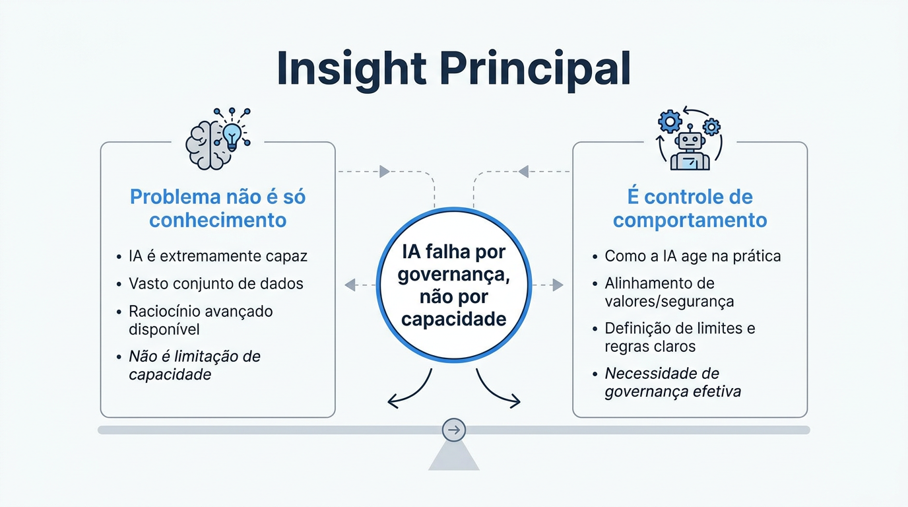

---

# Conclusão

- **RAG** = memória externa
- **Fine-Tuning** = aprendizado interno

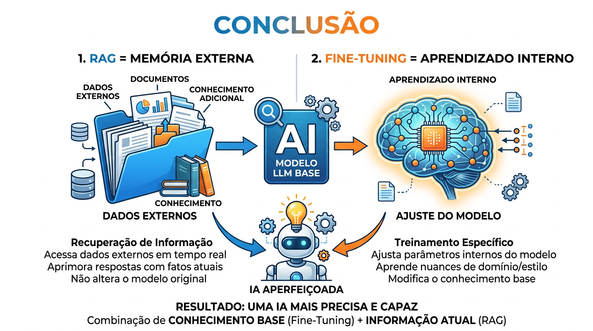

---

<!-- _class: lead -->
<!-- _backgroundColor: #065A82 -->

# Junte-se a Nós!

## CONAGEN — Congresso Nacional de IA Generativa

Trilhas de conhecimento em IA Generativa
Aprenda com especialistas | Networking | Inovação

**Inscreva-se Agora**

---

<!-- _class: lead -->

# Perguntas?

**Repositório:** [github.com/gilsoneng/conagen-2026](https://github.com/gilsoneng/conagen-2026)

**Próximo passo:** abrir `llm.ipynb` e seguir as células na ordem.
