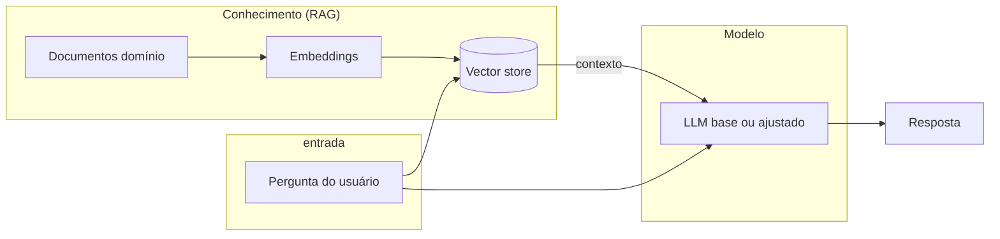
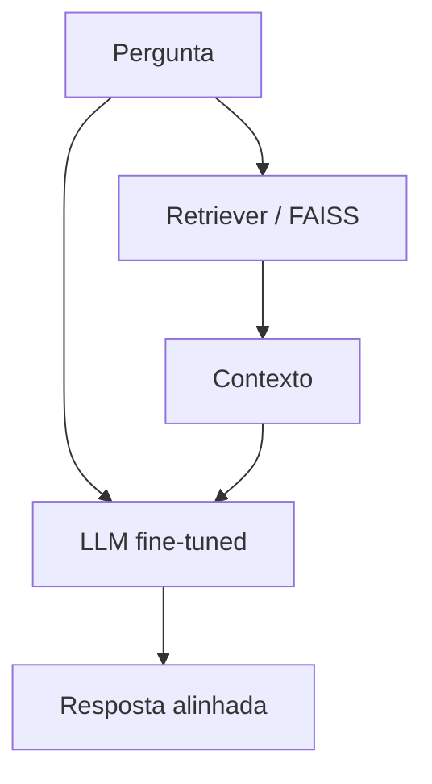

<!-- _class: lead -->

# Sistema LLM progressivo
## Do modelo base ao híbrido (RAG + ajuste fino)

**Objetivo:** separar **conhecimento** (externo) de **comportamento** (interno ao modelo)

---

# Agenda

1. Contexto e problema
2. Conceitos essenciais (base, RAG, prompt, fine-tuning)
3. Arquitetura proposta (diagrama)
4. Como resolvemos — estágios e código no GitHub
5. **Hands-on** (notebook + scripts) — um bloco por conceito

---

# Contexto

Queremos um assistente para **ACME Cloud** que:

- Responda com **fatos corretos** sobre políticas e processos
- Siga **regras de comportamento** (ex.: não sugerir atalhos que violem aprovação)

**Desafio:** um único “prompt mágico” nem sempre basta — precisamos **evoluir** a solução de forma didática.

---

# Conceito 1 — LLM base

- Modelo **genérico**, sem base de conhecimento do domínio
- Bom como **linha de referência** (“o que o modelo diria sozinho?”)
- Limitações: pode **inventar** ou **generalizar** fora do seu processo interno

**No repositório:** `examples/01_base.py` · função `ask_base` em `src/progressive_llm/pipeline.py`

---

# Conceito 2 — RAG (Retrieval-Augmented Generation)

- **Conhecimento externo** em documentos (textos do domínio)
- Embeddings + busca (ex.: **FAISS**) → recupera trechos relevantes
- O LLM **responde condicionado ao contexto** recuperado

**Ideia-chave:** RAG injeta **fatos** que podem mudar sem retreinar o modelo.

**No repositório:** `examples/02_rag.py` · dados em `src/progressive_llm/domain_data.py` (`DOMAIN_DOCS`)

---

# Conceito 3 — Controle por prompt

- Instruções rígidas no **system prompt** (políticas, tom, o que não pode fazer)
- Simula **governança** e regras de produto
- Complementa o RAG: contexto factual + **cerca** comportamental

**No repositório:** `examples/03_prompt_control.py` · `ask_rag_with_prompt_control` em `pipeline.py`

---

# Conceito 4 — Ajuste fino (fine-tuning)

- Treino com exemplos **supervisionados** (pares pergunta/resposta desejada)
- O modelo **internaliza padrões de resposta** — menos dependência de prompt longo
- **Não substitui** fatos que mudam o tempo todo: ainda convém RAG para conhecimento atualizável

**No repositório:** `examples/04_fine_tuning.py` · exemplos em `domain_data.py` (`TRAINING_DATA`)

---

# Distinção que importa

| | **RAG** | **Fine-tuning** |
|---|---------|-----------------|
| **O quê** | Conhecimento **externo** | Comportamento **interno** |
| **Muda como** | Atualiza documentos / índice | Novo treino / novo adapter |
| **Melhor para** | Fatos, processos, políticas textuais | Estilo, recusas, formato, política estável |

**Mensagem:** *RAG responde “com o quê”; fine-tuning molda “como”.*

---

# Arquitetura proposta (visão simples)



---

# Arquitetura final (híbrida)

**RAG** traz o **contexto factual** atual.

**Modelo ajustado** reforça **comportamento** (ex.: recusas consistentes, alinhamento com política).



**No repositório:** `examples/05_hybrid.py` · `ask_hybrid_rag_plus_finetuned` em `pipeline.py`

---

# Como resolvemos o problema (estágios)

1. **Base** — medir resposta sem domínio  
2. **RAG** — corrigir **factualidade** com documentos  
3. **Prompt** — adicionar **política** explícita  
4. **Fine-tuning** — **internalizar** comportamento desejado  
5. **Híbrido** — produção: conhecimento + comportamento

Cada estágio tem script dedicado em `examples/0X_*.py`.

---

# Mapa: slides → Hands-on → arquivos

| Bloco | Conceito | Notebook (`llm.ipynb`) | Script |
|-------|----------|------------------------|--------|
| 1 | Base | células iniciais | `examples/01_base.py` |
| 2 | RAG | idem | `examples/02_rag.py` |
| 3 | Prompt | idem | `examples/03_prompt_control.py` |
| 4 | Fine-tuning | idem | `examples/04_fine_tuning.py` |
| 5 | Híbrido | idem | `examples/05_hybrid.py` |

**Código compartilhado:** `src/progressive_llm/pipeline.py`, `domain_data.py`, `config.py`

---

# Setup rápido (para a demo)

```bash
python3 -m venv .venv && source .venv/bin/activate
pip install -r requirements.txt
export OPENAI_API_KEY="..."
export PYTHONPATH=src
```

**Notebook:** abrir `llm.ipynb` na raiz do projeto (kernel: venv do projeto).

**Segredo:** não commitar `.env` nem chaves — usar `.env.example`.

---

# Roteiro sugerido de Hands-on (tempo)

1. **2–3 min** — Base: pergunta ambígua; mostrar resposta genérica  
2. **3–5 min** — RAG: mesma pergunta com `DOMAIN_DOCS`  
3. **3–5 min** — Prompt: pergunta “atalho / bypass”  
4. **5–10 min** — Fine-tuning: job + status (ou modelo já treinado)  
5. **3–5 min** — Híbrido: `05_hybrid.py` com `fine_tuned_model` real

---

# Mensagem de fechamento

- **RAG** = atualizar **conhecimento** sem retreinar  
- **Fine-tuning** = **comportamento** estável e consistente  
- **Juntos** = arquitetura típica de produto: fatos + política

**Repositório:** README com instruções completas em `README.md`

---

<!-- _class: lead -->

# Perguntas?

**Próximo passo:** abrir `llm.ipynb` e seguir as células na ordem.
